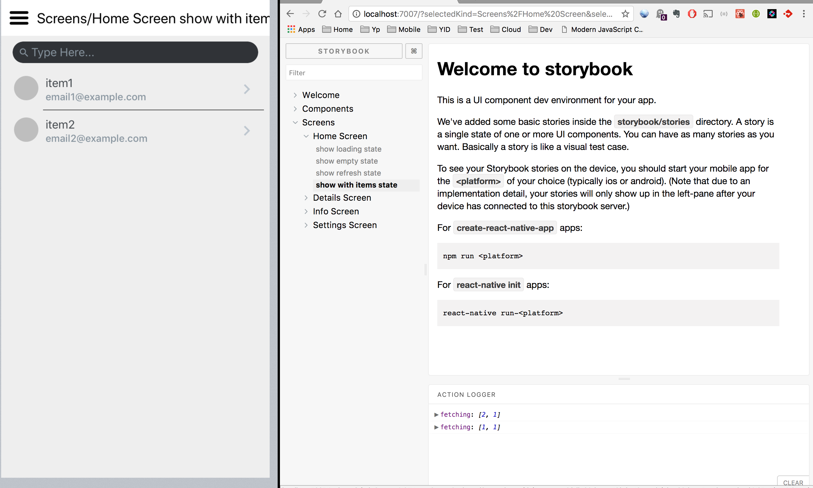

# rn-skeleton
I had some trouble finding example for integrating keys frameworks all together, 
it is easy to find on a specific topic but never how everything would work together. 
There are probably other ways to do this but feel free to leave comments or suggestions.

React native skeleton project for
* React Native
* React-Redux
* Redux-Persist
* React Navigation
* Redux-Saga
* Storybook
* Jest

[If you are not interested in storybooks, you can use version 0.1](https://github.com/syl20lego/rn-skeleton/tree/release/0.1)

## Application 

* Inspired by Spencer Carli tutorial

## Storybook



# Quick start

```Bash
git clone https://github.com/syl20lego/rn-skeleton.git
cd rn-skeleton/
npm install
npm start or npm run storybook
react-native run-ios
react-native run-android
```

# Step by step installation guide

I'll try to show all the commands you need to run to create your own project if you don't want to clone this one.

[Building Projects with Native Code](https://facebook.github.io/react-native/docs/getting-started.html)


## Command line tools
```Bash
npm install -g create-react-native-app
npm install -g react-native-cli
npm install -g react-native-git-upgrade
```

## Init

Create your own project.

```Bash
react-native init RNskeleton
git init
git add .
git commit -m "initial"
npm install
```

## Dependencies

### React Component

```Bash
npm install --save prop-types
```
```Bash
yarn add prop-types
```

### Redux,Persist,Saga

```Bash
npm install --save react-redux redux redux-logger
npm install --save redux-persist
npm install --save redux-saga
```
```Bash
yarn add react-redux redux redux-logger
yarn add redux-persist
yarn add redux-saga
```

### Navigation

```Bash
npm install --save react-navigation
```
```Bash
yarn add react-navigation
```

### Icons and Native Elements

```Bash
npm install --save react-native-elements
npm install --save react-native-vector-icons
react-native link
```
```Bash
yarn add react-native-elements
yarn add react-native-vector-icons
react-native link
```

### Fonts
```Bash
react-native link
```
## Testing

```Bash
npm install --save-dev jest babel-jest babel-preset-es2015 babel-preset-react react-test-renderer
npm install --save-dev jest-cli
npm install --save-dev nock
npm install --save-dev enzyme
npm install --save-dev enzyme-adapter-react-16
npm install --save-dev react-dom
```
```Bash
yarn add --dev jest babel-jest babel-preset-es2015 babel-preset-react react-test-renderer
yarn add --dev jest-cli
yarn add --dev nock
yarn add --dev enzyme
yarn add --dev enzyme-adapter-react-16
yarn add --dev react-dom
```

## StoryBook
```Bash
npm -g i @storybook/cli
```
```Bash
yarn global add @storybook/cli
```


```Bash
getstorybook
npm install
```

## Running Jest
```Bash
npm install -g jest
```

```Bash
jest --watch
```

## Running StoryBook

```Bash
yarn run storybook 
```
or 
```Bash
npm run storybook
```

## Runing Simulators

### iOS
```Bash
react-native run-ios
```
### Android
```Bash
react-native run-android
```
Show RN options
```Bash
adb shell input keyevent 82
```
Reload RN
```Bash
adb shell input text "RR"
```


# Architecture

From the application creation there are few choice to be made, I'll try to explains my decisions or sometime just use the defacto.

## Expo or Native Code
Right from the start you have to make one big decision, should I use Expo or go Native Code. The key to architecture is sometime delay the decision until it is important. Commiting to Expo right now seems to be a big steps and I want to decide which components to include along the way. I also want to be able to use my own native component, I could always eject with Expo but would be left with a big dependencies. Since this is a learning journey, I decided to go the native code way.


# Tutorial

React Native doesn't allow you to have anything other then alphanum chararcters in your project name, I name my repo rn-skeleton so I opt for RNskeleton and change the directory name when creating the project [Init](##Init).

Finaly this is the first version of react native 0.50 that doesn't generate the index.android.js and index.ios.js. We can start editing the App.js directly. I want my files to be under /src rather then /app since there is alreay an app.json and an App.js.

## Redux, Persist, Saga and the redux store

In our application the store and the persistor are coming from our store component, it is pretty much same as
[PersistGate example usage](https://github.com/rt2zz/redux-persist/blob/master/docs/PersistGate.md)

Application is our own application component.

`App.js`

```Javascript
render() {
        const {persistor, store} = Store;
        const onBeforeLift = () => {
            // take some action before the gate lifts
        };
        // persistor.purge();
        return (
            <Provider store={store}>
                <PersistGate
                    loading={<ActivityIndicator/>}
                    onBeforeLift={onBeforeLift}
                    persistor={persistor}>
                    <Application/>
                </PersistGate>
            </Provider>
        );
    }
```

We setup the store

`store/index.js`

```Javascript
const config = {
    key: 'root',
    storage,
};
const enhancers =
    [applyMiddleware(
        loggerMiddleware,
        sagaMiddleware
    )];
const persistConfig = {enhancers};
const store = createStore(persistCombineReducers(config, reducer), initialState, compose(...enhancers));
const persistor = persistStore(store, persistConfig);
sagaMiddleware.run(saga);
return {persistor, store};
```

In our reducers, we export the root reducer, but we keep each implementation inside their own reducer.

`reducers/index.js`

```Javascript
import navigator from './navigation.reducer';
import users from './users.reducer';

const rootReducer = {
    navigator,
    users
};

export default rootReducer;
```

Similar in our sagas we iterate and fork each implementation.
[Thanks to Jamie Sunderland proposal](https://github.com/redux-saga/redux-saga/issues/178)

`sagas/index.js`

```Javascript
import {fork} from 'redux-saga/effects';
import users from './users.saga';

const sagas = [
    ...users
];

export default function* root() {
    yield sagas.map(saga => fork(saga));
}
```

Each saga can export a list of saga generators

`sagas/user.saga.js`

```Javascript
function* fetchUsersSaga() {
    yield takeEvery(FETCH_USERS, fetchUsersEffect)
}


export default [fetchUsersSaga];
```

We javascript destructing for all actions in a common action creator

`actions/index.js` 

```Javascript
import * as Users from './users.action';

export const ActionCreators = {
    ...Users
};
```

Since we are using saga, our action creator can be simple objects.

`actions/users.action.js` 

```Javascript
export const fetchUsers = (page, seed) => {
    return {
        type: FETCH_USERS,
        data: {
            page,
            seed
        }
    };
};
```

## React navigation and redux

Our application is returning our root stack navigator, this is similar to 
[React Navigation with Redux Integration](https://reactnavigation.org/docs/guides/redux)

`src/index.js`

```Javascript
    render() {
        const { dispatch, navigator } = this.props;
        return (
            <Navigator
                navigation={
                    addNavigationHelpers({
                        dispatch,
                        state: navigator
                    })
                }
            />
        )
    }
}

const mapStateToProps = state => ({
    navigator: state.navigator,
});

export default Application = connect(mapStateToProps)(AppWithNavigation);

```

Navigation reducer 

`reducer/navigation.reducer.js`

```Javascript
import { NavigationActions } from 'react-navigation';

import Navigator  from '../routes';

const initialState = Navigator.router.getStateForAction(NavigationActions.init);

export default (state = initialState, action) => {
    const nextState = Navigator.router.getStateForAction(action, state);
    return nextState || state;
};
```

Our application is using Tab navigation, therefore our Root navigator setup the tabs. We need headerMode to ensure we don't show another navigation bar.

`routes/index.js`

```Javascript
export default Navigator = StackNavigator(
    {
        Tabs: {
            screen: Tabs
        }

    }, {headerMode: 'none'}
);
```

We setup 2 tabs

`routes/index.js`

```Javascript
const Tabs = TabNavigator(
    {
        HomeTab: {
            screen: HomeStack,

        },
        InfoTab: {
            screen: InfoStack,

        }
    }, {

    }
);
```

To keep things clean, each tabs in contained in a separated file.

`routes/home.route.js`

```Javascript
export default HomeRoute = {
    Home: {
        screen: HomeScreen,
        navigationOptions: ({navigation}) => ({
            ...tabs.item,
            title: 'Home',
            header: (Platform.OS === 'android') ? null : navigation.header,
        })
    },
    Details: {
        screen: DetailsScreen,
        navigationOptions: ({navigation}) => ({
            ...tabs.item,
            title: 'Details'
        })
    }
};
```

We can use destructing to reassemble the navigation stack.

`routes/index.js`

```Javascript
export const HomeStack = StackNavigator({
    ...HomeRoute
});
```

## Styles

I like the idea of centralized styles for common component as well as colors scheme and fonts. I was inspired by 
[react-native-weather](https://github.com/r3bl-alliance/react-native-weather)

I' still not sure what should be common, I find having flex instructions and margin a bit cumbersome and they are
probably better with the component.

## Storybook

Storybook is a nice framework to visualize your component without having to run the full application. This is useful 
for deep component inside your application that requires many steps to get to it. Therefore, it useful while developing your 
component and also it has the advantage to promote decouple components and provide an easy way to test.

We don't need android and iOS index anymore since React Native 0.50.
```Bash
rm storybook/index.android.js 
```
```Bash
rm storybook/index.ios.js 
```

Replace the index.js (under storybook) by the content of storybook.js (no need of the indirection)
```Bash
rm storybook/index.js 
mv storybook/storybook.js storybook/index.js
```

Move the stories undes the test folder.
```Bash
mv storybook/stories test/
```

You can access the storybook via the browser
http://localhost:7007/

By default storybook and stories are created under the same folder storybook, after cleaning up the old ios and android
index files, I moved the stories under /test. This makes it easier to have all non production code under the same
folder.

I like to keep thing organized separately so you have one stories file per components. 

## Testing

My preference is to have all test under the same directory structure (aka /test), this allow you to have the test separated by 
their categories: unit, integration. Since integration tests might require more time/setup. I also consider storybooks
as non production code and kept it under the /test folder. 

### Unit testing

You need to configure JEST, setup file, ignore files

`package.json`
```
 "jest": {
    "preset": "react-native",
    "setupFiles": [
      "./__tests__/setup"
    ],
    "testPathIgnorePatterns": [
      "/node_modules/",
      "./__tests__/setup"
    ],
    "transformIgnorePatterns": [
      "node_modules/(?!react-native|react-navigation)/"
    ],
    "coverageReporters": [
      "html",
      "text"
    ]
  }
```

`__tests__/setup.js`

In the setup, I use the following configuration

```Javascript
global.XMLHttpRequest = require("isomorphic-fetch");
import Enzyme from 'enzyme'
import Adapter from 'enzyme-adapter-react-16'
Enzyme.configure({ adapter: new Adapter() });
```

Actions are really easy to test, you just need to ensure they provide the correct object.

`/test/unit/actions/users.actions.spec.js`

```Javascript
it('Should create an action to fetch users', () => {
    const page = 3;
    const seed = 'ABC';
    const expectedAction = {
        type: types.FETCH_USERS,
        data: {
            page,
            seed
        }
    };
    expect(ActionCreators.fetchUsers(page, seed)).toEqual(expectedAction)
});
```

You can test javascript function, I like to use Nock for API testing
[HTTP mocking and expectations library](https://github.com/node-nock/nock)

`/test/unit/api/users.api.spec.js`

```Javascript
it('API works correctly to fetch users', (done) => {
    let seed = 22;
    let page = 1;
    nock('https://randomuser.me', {})
        .get(`/api/?seed=${seed}&page=${page}&results=20`)
        .reply(200, `
    {"results": [{
        "name": {
        "first": "nicholas"
        }
    }]}`);
    fetchUsers({seed, page})
        .then((result) => {
            expect(result.error).toBeNull();
            expect(result.list).toHaveLength(1);
            expect(result.list[0].name.first).toBe('nicholas');
        })
        .then(done)
        .catch(done)
});
```

Because the reducers are simply managing states, they are easy to test and you just need to ensure they are 
creating the proper state given any actions

`/test/unit/reducers/users.reducers.spec.js`

```Javascript
it('should return the initial state', () => {
    console.log('REDUCERS HERE !!!!', reducers.users);
    expect(reducers.users(undefined, {})).toEqual(
        {
            "error": null,
            "list": [],
            "loading": false,
            "page": 1,
            "refreshing": false,
            "seed": 1
        }
    )
});
```
Todo: React Component unit testing

## Integration test

`App.spec.js` is an integration test, I haven't put much work into it yet, I found testing UX high maintenance.

Should we have redux integration testing instead ? Testing actions/reducers/sagas would be an option instead of UX testing. 


# References

[Expo demonstrating how to build my app Capo Keys from scratch to deployment](https://www.youtube.com/playlist?list=PL06z42zB6YZ-9CQDX015uaeqMcSErKbes)
* Thanks to Barry Michael Doyle for this excellent tutorial about developing an application from begining to the end using Expo and Redus. Very good explanations and enjoyable to watch

[Simple React Native application with Redux](https://www.youtube.com/watch?v=3msLwu25SQY&list=PLk083BmAphjtGWyZUuo1BiCS_ZAgps6j5)
* Thanks to Jon Lebensold that provided me with the basic skeleton for redux. `createReducer.js` is interesting to simplify the reducer switch case. I haven't use it yet since it makes the reducers pattern looking different.

[FlatList and random user api](https://www.youtube.com/watch?v=r-ENJLGrd3s)
* Thanks to Spencer Carli to giving the UX idea and api as well as the good explanation how to setup FlatList

[What is the right way to do asynchronous operations in Redux?](https://decembersoft.com/posts/what-is-the-right-way-to-do-asynchronous-operations-in-redux/)
* Provides good overview of different solutions for asynchronous framework working with redux. In the end, I select redux-sagas since I like keeping my actions being plain object and reducers simple and only handling states

[Adding custom Fonts](https://medium.com/react-native-training/react-native-custom-fonts-ccc9aacf9e5e)

# Links

## Framework

[React component](https://facebook.github.io/react-native/docs/components-and-apis.html)

[React Native Elements Cross Platform React Native UI Toolkit ](https://react-native-training.github.io/react-native-elements/)

[React-redux](https://github.com/reactjs/react-redux)

[Redux-Persist](https://github.com/rt2zz/redux-persist)

[React Navigation with Redux Integration](https://reactnavigation.org/docs/guides/redux)

[Storybook is a development environment for UI components](https://github.com/storybooks/storybook)

## Test

[Jest Expect](https://facebook.github.io/jest/docs/en/expect.html#content)

[Enzyme Shallow](http://airbnb.io/enzyme/docs/api/ShallowWrapper/shallow.html)

[HTTP mocking and expectations library](https://github.com/node-nock/nock)

## Tutorial

[Learning React Native](http://www.reactnativeexpress.com/)


# Environment

macOS Sierra
Version 10.12.6

npm --version
5.6.0

node --version
v8.6.0

react-native --version
react-native-cli: 2.0.1
react-native: 0.52.0
